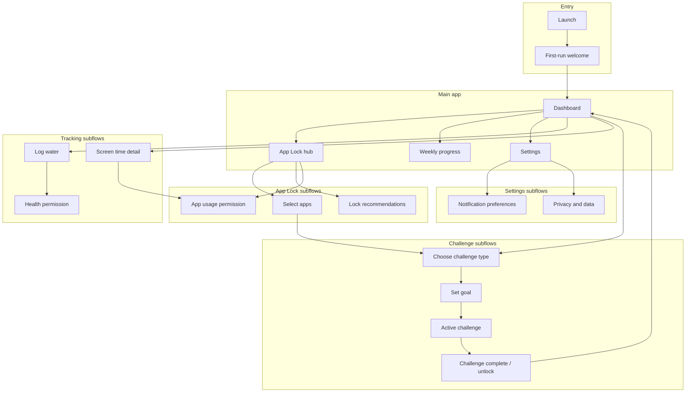
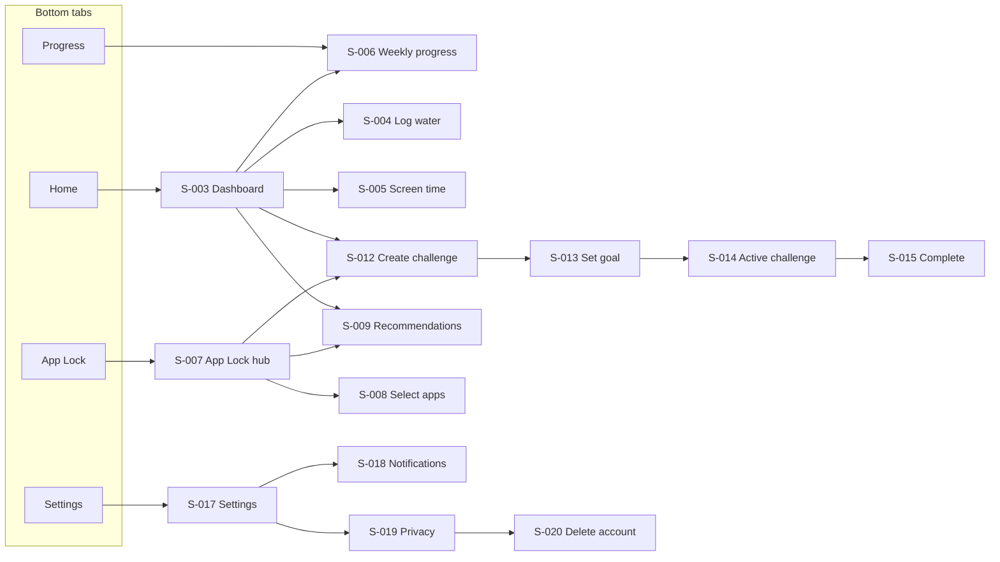

# Mizora — UX Specification (V1)

**Document version:** 1.0  
**Last updated:** August 4, 2026  
**Status:** Derived from approved [PRD](./PRD.md)  
**Scope:** Version 1 only — no visual/UI specification

This document defines screens, flows, navigation, permissions, and edge cases. It does not include layouts, components, colors, or mockups.

---

## 1. Document goals

- Give design and engineering a shared map of **where** users go and **why**.
- Align V1 UX with PRD principles: short onboarding, dashboard-first, just-in-time permissions, no App Lock during first run, clarity over complexity.
- Surface **edge cases** early so lock/unlock and permission flows remain trustworthy.

---

## 2. Information architecture (V1)

---

## 3. Screen list

Each screen has a stable ID for traceability in specs and tickets.

| ID        | Screen name                            | Type                         | Entry points                                         |
| --------- | -------------------------------------- | ---------------------------- | ---------------------------------------------------- |
| **S-001** | Launch                                 | System                       | Cold start                                           |
| **S-002** | First-run welcome                      | Full screen                  | First launch only                                    |
| **S-003** | Dashboard                              | Tab root                     | Post-welcome; tab Home; deep links to home           |
| **S-004** | Log water                              | Modal or pushed screen       | Dashboard water action                               |
| **S-005** | Screen time detail                     | Pushed                       | Dashboard screen time row                            |
| **S-006** | Weekly progress summary                | Tab root or pushed           | Tab Progress; dashboard “weekly” link                |
| **S-007** | App Lock hub                           | Tab root                     | Tab App Lock; dashboard CTA                          |
| **S-008** | Select apps to lock                    | Pushed                       | App Lock hub                                         |
| **S-009** | Recommended apps to lock               | Pushed                       | App Lock hub; dashboard suggestion card              |
| **S-010** | App usage permission explainer         | Modal / sheet                | Before OS permission; screen time or recommendations |
| **S-011** | Health permission explainer            | Modal / sheet                | Before OS permission; steps or water from health     |
| **S-012** | Create challenge — type                | Pushed                       | App Lock hub; dashboard; post app selection          |
| **S-013** | Create challenge — goal                | Pushed                       | After type selection                                 |
| **S-014** | Active challenge detail                | Pushed                       | Dashboard active challenge; notification tap         |
| **S-015** | Challenge completed                    | Modal / full screen          | Auto when goal met                                   |
| **S-016** | Locked app intercept                   | System overlay / full screen | User opens a locked app (platform-dependent)         |
| **S-017** | Settings                               | Tab root                     | Tab Settings                                         |
| **S-018** | Notification preferences               | Pushed                       | Settings                                             |
| **S-019** | Privacy and data                       | Pushed                       | Settings                                             |
| **S-020** | Delete account confirmation            | Pushed / modal               | Privacy and data                                     |
| **S-021** | Push notification permission explainer | Modal / sheet                | When user enables notifications in S-018             |
| **S-022** | App Lock empty state (education)       | Inline on S-007              | No apps locked yet                                   |
| **S-023** | Not found                              | Full screen                  | Invalid routes                                       |

**Out of scope for V1 (no screens):** Premium paywall, AI coach, social, sleep/workout/nutrition, wearables, ads.

---

## 4. Screen purpose

### S-001 — Launch

- **Purpose:** Transition into app; restore session if applicable.
- **Primary content:** None required beyond brand/load (no permission prompts).
- **Success:** User lands on S-002 (first launch) or S-003 (returning) within PRD performance expectations.

### S-002 — First-run welcome

- **Purpose:** Minimal identity optional; fastest path to value.
- **Primary content:** One-line value prop; optional name field; primary CTA to continue.
- **Success:** User reaches S-003 in **15–20 seconds** without App Lock or OS permissions.
- **Explicitly excluded:** App selection, challenges, health/usage permissions.

### S-003 — Dashboard

- **Purpose:** Single home for daily motivation and next actions.
- **Primary content (PRD):**
  - Today’s steps
  - Today’s water intake
  - Active challenge(s)
  - Completed challenges (today or recent — keep scannable)
  - Unlocked apps status
  - Current streak
  - Entry to weekly summary
  - Soft CTAs: enable App Lock (if not set up), start challenge, view recommendations (when usage data available)
- **Success:** User understands progress at a glance and can start one clear action in one tap.

### S-004 — Log water

- **Purpose:** Record water intake toward daily total and active water challenges.
- **Primary content:** Add intake (mechanism TBD in PRD open items: manual vs presets); show today’s total.
- **Success:** Intake saved; dashboard and challenge progress update.

### S-005 — Screen time detail

- **Purpose:** Show today’s screen time in simple terms (not advanced analytics).
- **Primary content:** Total today; optional top apps list if usage permission granted.
- **Success:** User sees meaningful usage context without overwhelm.

### S-006 — Weekly progress summary

- **Purpose:** Simple weekly habit view (PRD: “simple weekly progress summary”).
- **Primary content:** Week-level steps, water, challenges completed, streak context; no dense charts in V1.
- **Success:** User feels progress over time without analysis fatigue.

### S-007 — App Lock hub

- **Purpose:** Control center for locking, unlock state, and linking challenges.
- **Primary content:** List of locked apps; global lock enabled/disabled; link to add apps and recommendations; active unlock window/status (per product rules).
- **Success:** User can manage locks and understand current access state.

### S-008 — Select apps to lock

- **Purpose:** User explicitly chooses which apps to gate.
- **Primary content:** Searchable/selectable app list; selected count; confirm.
- **Success:** Selection saved; user never feels apps were locked without consent.

### S-009 — Recommended apps to lock

- **Purpose:** Suggest apps based on usage patterns; user opts in per app.
- **Primary content:** Recommended list with brief reason (e.g., high usage); accept/dismiss per app.
- **Success:** Recommendations increase adoption without auto-locking.

### S-010 — App usage permission explainer

- **Purpose:** Transparency before OS dialog; explain why Mizora needs usage/screen time access.
- **Primary content:** What is collected, what stays on device, link to privacy; Continue / Not now.
- **Success:** Informed consent; if denied, graceful fallback (see edge cases).

### S-011 — Health permission explainer

- **Purpose:** Transparency before Health/Motion (or platform equivalent) permission.
- **Primary content:** Steps (and related) only as needed; no medical claims; Continue / Not now.
- **Success:** User grants or declines with clear impact on step tracking.

### S-012 — Create challenge — type

- **Purpose:** User picks step goal or water intake goal.
- **Primary content:** Two challenge types only in V1.
- **Success:** Type selected; proceed to goal configuration.

### S-013 — Create challenge — goal

- **Purpose:** Set target (e.g., step count, water volume) for unlock eligibility.
- **Primary content:** Goal input; summary of which apps unlock on completion (if locks exist).
- **Success:** Challenge becomes active; locks enforce until completion (per unlock rules).

### S-014 — Active challenge detail

- **Purpose:** Progress toward goal and remaining requirement.
- **Primary content:** Progress indicator; type-specific actions (e.g., log water); cancel/edit if product allows.
- **Success:** User knows exactly what is left to unlock.

### S-015 — Challenge completed

- **Purpose:** Positive reinforcement; confirm unlock.
- **Primary content:** Encouraging completion message; which apps are unlocked; duration/rules summary (when product defines unlock rules).
- **Success:** User associates healthy action with reward; returns to S-003 or uses unlocked apps.

### S-016 — Locked app intercept

- **Purpose:** When user opens a locked app, explain gate and path to unlock (no guilt/shame copy per PRD).
- **Primary content:** Locked state; link to active challenge or create challenge; optional snooze only if product allows (V1 default: no punitive messaging).
- **Success:** User redirected to complete habit, not trapped or shamed.

### S-017 — Settings

- **Purpose:** Account, preferences, legal, support entry.
- **Primary content:** Links to notifications, privacy, about/help; sign out if accounts exist.
- **Success:** User finds controls without hunting.

### S-018 — Notification preferences

- **Purpose:** User control over notification types and quiet hours.
- **Primary content:** Toggles: challenge reminders, challenge completed, unlock ready, streak; quiet hours default 10 PM–8 AM; master enable.
- **Success:** User trust; aligns with 2–3/day cap at system/scheduling layer.

### S-019 — Privacy and data

- **Purpose:** PRD transparency commitments.
- **Primary content:** What data is collected and why; on-device vs server; no sale of data; delete account entry.
- **Success:** User can make informed privacy choices.

### S-020 — Delete account confirmation

- **Purpose:** Irreversible account and data deletion.
- **Primary content:** Clear warning; confirm action; completion state.
- **Success:** Account and associated server data removed per policy; local data cleared as specified in tech spec.

### S-021 — Push notification permission explainer

- **Purpose:** Explain push before OS prompt when user enables notifications.
- **Primary content:** Types of pushes; no promos; Continue / Not now.
- **Success:** OS permission requested only after opt-in to Mizora notification settings.

### S-022 — App Lock empty state (on S-007)

- **Purpose:** Educate after dashboard discovery; not during onboarding.
- **Primary content:** How lock + challenge works; CTA to select apps or view recommendations.
- **Success:** User initiates lock setup voluntarily.

### S-023 — Not found

- **Purpose:** Recover from invalid navigation.
- **Primary content:** Message; return to dashboard.
- **Success:** User not stuck.

---

## 5. Navigation

### 5.1 Navigation model (V1)

**Primary:** Bottom tab bar with **four tabs** (labels are product copy, not UI):

| Tab order | Destination | Screen ID                     |
| --------- | ----------- | ----------------------------- |
| 1         | Home        | S-003 Dashboard               |
| 2         | App Lock    | S-007 App Lock hub            |
| 3         | Progress    | S-006 Weekly progress summary |
| 4         | Settings    | S-017 Settings                |

**Secondary:** Stack navigation within each tab for pushed screens (S-004–S-015, S-018–S-020).

**Modals / sheets:** Permission explainers (S-010, S-011, S-021), challenge completed (S-015), water log (S-004) may be modal per platform convention—behavior equivalent regardless of presentation.

### 5.2 Global rules

- **No tab hides core state:** Dashboard always reflects latest steps, water, streak, and challenge status when user switches tabs.
- **Back behavior:** Pushed screens return to prior context; completing a challenge may dismiss to Dashboard (Home tab).
- **Deep links (V1 minimum):** Notification taps open relevant screen (S-014 active challenge, S-015 if completion pending, S-003 default).
- **No premium gates** on tab access in V1.

### 5.3 Navigation diagram

---

## 6. User flows

### 6.1 Flow A — First launch (target &lt; 20 s)

| Step | Screen          | User action             | System behavior                                                 |
| ---- | --------------- | ----------------------- | --------------------------------------------------------------- |
| 1    | S-001 Launch    | —                       | Route first-time vs returning                                   |
| 2    | S-002 Welcome   | Optional name; Continue | Persist minimal profile; mark onboarding complete for analytics |
| 3    | S-003 Dashboard | Explore                 | Show placeholders or zeros for metrics; no OS permissions yet   |

**Exit criteria:** Onboarding complete event fired; user on dashboard without App Lock setup.

---

### 6.2 Flow B — Discover App Lock from dashboard

| Step | Screen         | User action                                   | System behavior                                                |
| ---- | -------------- | --------------------------------------------- | -------------------------------------------------------------- |
| 1    | S-003          | Tap “Set up App Lock” (or visit App Lock tab) | Show S-022 empty state if no locks                             |
| 2    | S-007          | Choose add apps                               | Navigate to selection or recommendations                       |
| 3    | S-008 or S-009 | Select apps                                   | Save lock list; enforce only after challenge/link rules active |
| 4    | S-012 → S-013  | Create linked challenge (if required)         | Activate lock + challenge per product rules                    |

---

### 6.3 Flow C — Step challenge unlock

| Step | Screen         | User action          | System behavior                                                               |
| ---- | -------------- | -------------------- | ----------------------------------------------------------------------------- |
| 1    | S-003 or S-007 | Start step challenge | If no health permission → S-011 → OS prompt                                   |
| 2    | S-012          | Choose Steps         | —                                                                             |
| 3    | S-013          | Set step goal        | Create active challenge                                                       |
| 4    | S-014          | Monitor progress     | Sync steps from health source                                                 |
| 5    | S-015          | —                    | On goal met: mark complete, unlock apps, schedule notifications (within caps) |
| 6    | S-003          | Continue             | Update streak, completed list, unlock status                                  |

---

### 6.4 Flow D — Water challenge unlock

| Step | Screen        | User action                        | System behavior                               |
| ---- | ------------- | ---------------------------------- | --------------------------------------------- |
| 1    | S-003         | Start water challenge or log water | S-011 if health-linked water; else S-004 only |
| 2    | S-012 / S-013 | Water type + goal                  | Active challenge                              |
| 3    | S-004         | Log intake                         | Increment progress                            |
| 4    | S-015         | —                                  | On goal met: complete + unlock                |
| 5    | S-003         | —                                  | Updated totals and streak                     |

---

### 6.5 Flow E — Screen time and recommendations

| Step | Screen | User action            | System behavior                            |
| ---- | ------ | ---------------------- | ------------------------------------------ |
| 1    | S-003  | Open screen time       | If no usage permission → S-010 → OS prompt |
| 2    | S-005  | View today’s usage     | Show simple summary                        |
| 3    | S-009  | Review recommendations | List derived from usage                    |
| 4    | S-008  | Confirm apps to lock   | User must confirm each recommendation      |

---

### 6.6 Flow F — Returning user (daily loop)

| Step | Screen | User action                  | System behavior                             |
| ---- | ------ | ---------------------------- | ------------------------------------------- |
| 1    | S-003  | Open app                     | Refresh today’s metrics and challenge state |
| 2    | S-014  | Complete remaining challenge | Unlock when criteria met                    |
| 3    | —      | Receive notifications        | Max 2–3/day; respect quiet hours            |
| 4    | S-006  | Optional weekly check-in     | Simple summary                              |

---

### 6.7 Flow G — Notification settings

| Step | Screen | User action                       | System behavior              |
| ---- | ------ | --------------------------------- | ---------------------------- |
| 1    | S-017  | Open notification settings        | —                            |
| 2    | S-018  | Enable types / adjust quiet hours | Persist preferences          |
| 3    | S-021  | Enable master notifications       | OS push permission if needed |

---

### 6.8 Flow H — Account deletion

| Step | Screen | User action    | System behavior                                           |
| ---- | ------ | -------------- | --------------------------------------------------------- |
| 1    | S-019  | Delete account | Navigate to confirmation                                  |
| 2    | S-020  | Confirm        | Delete server data; clear local; return to S-002 or S-001 |

---

## 7. Required permissions

### 7.1 Permission matrix

| Permission                                         | OS / platform                                                        | Required for                                                   | Request trigger (screen)                                    | If denied                                                                                               |
| -------------------------------------------------- | -------------------------------------------------------------------- | -------------------------------------------------------------- | ----------------------------------------------------------- | ------------------------------------------------------------------------------------------------------- |
| **App usage / Screen Time**                        | Android Usage Access; iOS Screen Time API (platform TBD in eng spec) | Screen time detail, lock recommendations, App Lock enforcement | S-010 before first use of S-005, S-009, or lock enforcement | Hide or degrade usage-based features; allow manual app pick on S-008; explain how to enable in Settings |
| **Health / Motion (steps)**                        | Health Connect / HealthKit / motion                                  | Step tracking, step challenges                                 | S-011 before step challenge or step display                 | Show steps as unavailable; water-only challenges still work; neutral copy, no blame                     |
| **Notifications (push)**                           | OS notification permission                                           | Reminders, completion, unlock, streak pushes                   | S-021 when user enables in S-018                            | In-app state only; no push; user can re-enable later                                                    |
| **Overlay / accessibility (if required for lock)** | Platform-specific for intercept                                      | S-016 locked app intercept                                     | When enabling App Lock (with explainer on S-007)            | App Lock may not block opens—show honest limitation and in-app reminders                                |

### 7.2 Permission principles (from PRD)

- **Just-in-time only** — never on S-002 welcome.
- **Explainer before OS dialog** — S-010, S-011, S-021.
- **No secondary permission** for V1 features not in scope (location, camera, contacts, etc.).

### 7.3 Data handling (UX-facing)

- Privacy copy on S-010, S-011, S-019 must state: minimum collection, no ad resale, deletion available.
- Prefer on-device processing in user-facing language where true per implementation.

---

## 8. Edge cases

### 8.1 Onboarding and session

| Case                              | Expected UX behavior                                                                                        |
| --------------------------------- | ----------------------------------------------------------------------------------------------------------- |
| User force-quits during S-002     | Next launch: skip welcome if onboarding marked complete; else show S-002 again                              |
| User skips optional name          | Dashboard uses generic greeting; no blocking                                                                |
| Returning user after long absence | S-003 shows current day; streak rules defined in product logic (break streak vs pause—document in eng spec) |

### 8.2 Permissions

| Case                                       | Expected UX behavior                                                   |
| ------------------------------------------ | ---------------------------------------------------------------------- |
| Health granted then revoked in OS settings | S-003/S-014 show steps unavailable; prompt to re-enable via S-011 once |
| Usage denied but user sets up App Lock     | Allow manual S-008; recommendations hidden or empty with explanation   |
| Partial health data (delayed sync)         | S-014 shows last synced time; avoid false “incomplete” if sync lag     |
| Push denied                                | S-018 shows in-app only; no repeated nagging                           |

### 8.3 App Lock and intercept

| Case                                                       | Expected UX behavior                                                                                          |
| ---------------------------------------------------------- | ------------------------------------------------------------------------------------------------------------- |
| No apps selected                                           | S-007 empty state; locks not enforced                                                                         |
| User removes all locked apps while challenge active        | Clarify whether challenge still runs (recommend: yes, but no lock until apps re-added—state clearly on S-014) |
| User opens locked app with no active challenge             | S-016 offers create challenge (S-012); no shame copy                                                          |
| Multiple locked apps, partial unlock rules (PRD open item) | UX must show one clear unlock status on S-003 and S-007; avoid contradictory “unlocked” labels                |
| Unlock expires (if time-based unlock)                      | S-003 and S-007 show locked again; optional “unlock ready” notification if user opted in                      |
| Mizora itself targeted for lock                            | Exclude Mizora from lock list by default to avoid dead-end                                                    |
| System apps / browsers                                     | Platform limits: show “cannot lock” with reason on S-008                                                      |

### 8.4 Challenges

| Case                               | Expected UX behavior                                                                     |
| ---------------------------------- | ---------------------------------------------------------------------------------------- |
| Two active challenges (if allowed) | If V1 allows one active only: block second with friendly message on S-012                |
| Goal already met at creation       | Prevent zero/negative goals on S-013                                                     |
| User completes steps offline       | On reconnect, reconcile and trigger S-015 if threshold crossed                           |
| User logs water over goal          | Accept overage; celebrate completion without scolding “ excess”                          |
| Cancel challenge mid-way           | Define in product: locks remain; user confirm on S-014; no punitive messaging            |
| Day boundary (midnight)            | Daily steps/water reset; challenge progress rules explicit (calendar day vs rolling 24h) |

### 8.5 Tracking and recommendations

| Case                            | Expected UX behavior                                        |
| ------------------------------- | ----------------------------------------------------------- |
| No usage data yet               | S-009 empty: “Check back after a day of usage”              |
| Newly installed app not in list | Refresh app list on S-008; handle OS delay                  |
| Screen time reads zero          | Distinguish “no permission” vs “no usage” vs “sync pending” |

### 8.6 Notifications

| Case                                   | Expected UX behavior                                              |
| -------------------------------------- | ----------------------------------------------------------------- |
| Daily cap (2–3) reached                | Drop lower-priority reminders; never batch spam                   |
| Quiet hours                            | Queue or skip until 8 AM unless user disables quiet hours         |
| Challenge completes during quiet hours | Completion may show in-app on next open; push optional per policy |
| All toggles off in S-018               | No pushes except critical legal (if any)—none in V1               |

### 8.7 Account, privacy, errors

| Case                             | Expected UX behavior                                                      |
| -------------------------------- | ------------------------------------------------------------------------- |
| Delete account fails (network)   | S-020 retry; do not sign user out until confirmed                         |
| Guest vs account (PRD open item) | UX must still offer S-019 deletion path for all user types                |
| Offline mode                     | Dashboard shows cached data with subtle stale indicator; queue water logs |
| Server error on sync             | Non-blocking toast; core lock/challenge trustworthy locally first         |
| Invalid deep link                | S-023 → S-003                                                             |

### 8.8 Trust and tone (PRD)

| Case                   | Expected UX behavior                                                     |
| ---------------------- | ------------------------------------------------------------------------ |
| Repeated lock failures | Never use guilt/fear; offer help and settings links                      |
| Low streak after miss  | Encouraging reset message; no “you failed” framing                       |
| Medical questions      | No health advice screens in V1; direct to professionals in FAQ if needed |

---

## 9. Dependencies on open PRD items

These UX flows assume engineering/product will lock decisions soon:

| Open item                              | UX impact                                  |
| -------------------------------------- | ------------------------------------------ |
| Unlock duration/rules after completion | S-015, S-003, S-007, S-016 copy and states |
| Water logging mechanism                | S-004 interaction model                    |
| Guest vs required account              | S-002, S-017, S-020 flows                  |
| Single vs multiple active challenges   | S-012 gating rules                         |

Until resolved, implementations should use the **most conservative user-trust default**: clear status text, no silent lock changes, user confirmation on destructive actions.

---

## 10. V1 UX success checklist

- [ ] First-time user reaches S-003 within 15–20 seconds without permissions.
- [ ] App Lock is never forced during onboarding.
- [ ] Every OS permission is preceded by an explainer screen.
- [ ] Dashboard surfaces all PRD user-facing metrics without clutter.
- [ ] Lock → challenge → unlock loop is navigable in ≤ 5 taps from dashboard for a motivated user.
- [ ] Notification preferences and quiet hours are discoverable in Settings.
- [ ] Account/data deletion is reachable from Privacy and data.
- [ ] Edge cases in §8 have documented copy and state behavior before release.

---

## 11. Related documents

- [PRD.md](./PRD.md) — product scope, principles, and roadmap
- Technical specification (TBD) — platform APIs for lock, health sync, notification scheduling

---

_End of document_
